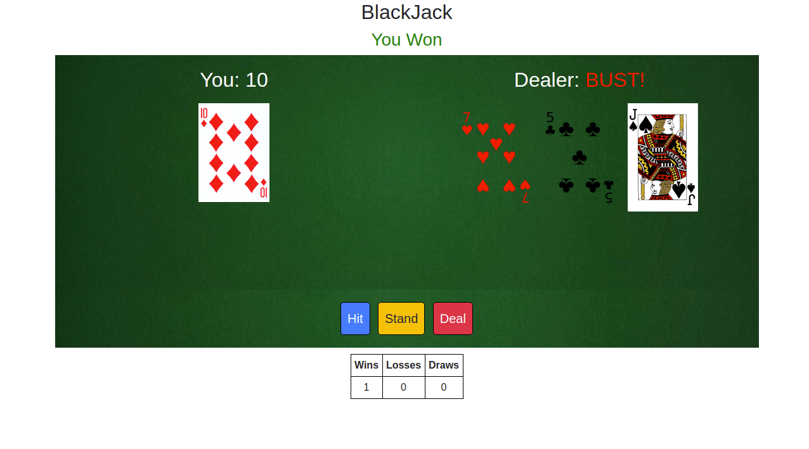

# BlackJack

## Description:
This is a light blackjack app made with 13 cards. The user plays with a computer to know which one can hit the maximum target (below 22). If one of the player hits more than 21, he loses or it's a draw.

## Technologies:

- HTML
- CSS
- Javascript

## Developed by

Mouhamadou Diouf ( <a href="https://github.com/MouhaDiouf"> @mouhad </a>)

## Contributing

1. Fork it (https://github.com/MouhaDiouf/BlackJack)
2. Create your feature branch (git checkout -b feature/[choose-a-name])
3. Commit your changes (git commit -am 'What this commit will fix/add')
4. Push to the branch (git push origin feature/[chosen name])
5. Create a new Pull Request

## Live version:
<a href="https://mouhadiouf.github.io/BlackJack/" target="_blank">Blackjack Game</a>
